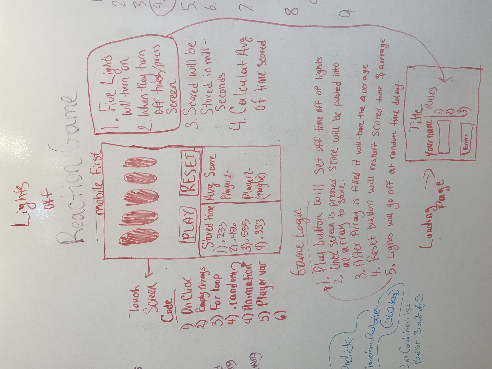

# Project Overview

## Project Schedule

This schedule will be used to keep track of your progress throughout the week and align with our expectations.  

|  Day | Deliverable | 
|---|---| 
|Day 1: Tue| Wireframes and Priority Matrix|
|Day 2: Wed| Project Approval /  Pseudocode / actual code|
|Day 3: Thur| Basic Clickable Model |
|Day 4: Fri| Working Prototype |
|Day 5: Sat| Final Working Project |
|Day 6: Sun| Bugs / Stylying / PostMVP |
|Day 7: Mon| Project Presentations |

## Project Description

Use this section to describe your final project and perhaps any links to relevant sites that help convey the concept and\or functionality.

So I will be making a quick reaction game. Inspired by both Motorsports racing and reaction time games, I wanted to make my own version. 
- For the lights here is an example of what I want it to look like: https://f1-start.glitch.me/
- As for finding out the average I got inspiration from https://www.humanbenchmark.com/tests/reactiontime/
- The second link does not have a list of your time scores. From what I researched they used satistics based off average (median) reaction time. 
- I don't want to worry about statistics. I just want to keep it minimal.

## Wireframes

Include images of your wireframes. 

## Priority Matrix

Include a full list of features that have been prioritized based on the `Time and Importance` Matix.  

- Landing page
- HTML and CSS of design shell
- Game logic

## Game Components

### Landing Page
What will a player see when they start your game?

- The title page.
- A prompt will show up to ask for your name (Still deciding??)
- Rules: instructions on how to play the game.
- A button to enter the main page of the game.

### Game Initialization
What will a player see when the game is started? 

- The title of the game. 
- The player will see five empty circles on the screen. 
- Below will be two buttons: Play and Reset
- The play button which will start the the initiate the game
- A reset button that will reset you stored times.
- A column for your stored time and average.

### Playing The Game
What will be the flow of the game, what will the user be expeted to do and what will the user expect from the game

- The user will be told to press the play button when needed from the rules on the landing page
- When they press play the lights will turn off and after a certain amount of time they will turn off.
- When the lights turn off the player must tap/click the screen immediately after. 
- The faster there reaction time is after the lights turn off the lower the stored number.
- They will do this either 4 or 5 times there time being stored. 
- After they complete the needed amount they will get there average time.
- The user will be expected to try and see how fast they are in reacting to the lights turning off quickly. 

### Winning The Game
What does it look like when the game ends, what determines winning or losing?

- I think this is the downside to my game. I do not have a winner or loser.
- I can only see that happening if I have a second player implemented into the game to check who has the highest average.

### Game Reset
How will the user restart the game once it has been completed.

- The player will be able to press/click on the restart button.

## MVP 

Include the full list of features that will be part of your MVP 

- 1 player
- Enter your name (Still deciding)
- Press enter button to leave landing page to go to main page
- Press Play to initialize game
- Lights will turn on one after the other using CSS keyframes and animations
    - Light will turn off using CSS keyframes, animations and delay.
    - Delays will be using a random method.
- Using mouse click events the user will stop a timer that will be counting up by milliseconds
- Result will be stored in an empty array and user will be able to play again 
- Once player has tried 4 or 5 times the array will add and divide to find the average speed
- User click on the restart button to start fresh a new set of time scores.

## POST MVP

Include the full list of features that you are considering for POST MVP

- 2 Players
- Both players can play and reset when the maximum has been reached 
- Store one more set of time data
- Have the average of both time data

## Functional Components

Based on the initial logic defined in the previous game phases section try and breakdown the logic further into functional components, and by that we mean functions.  Does your logic indicate that code could be encapsulated for the purpose of reusablility.  Once a function has been defined it can then be incorporated into a class as a method. 

Time frames are also key in the development cycle.  You have limited time to code all phases of the game.  Your estimates can then be used to evalute game possibilities based on time needed and the actual time you have before game must be submitted. 

| Component | Priority | Estimated Time | Time Invetsted | Actual Time |
| --- | :---: |  :---: | :---: | :---: |
| Landing Page | M | 2 hrs| #hrs | #hrs |
| HTML & CSS | M | 3 hrs| #hrs | #hrs |
| Game Logic | H | 13 hrs| #hrs | #hrs |
| Total |  | 18hrs| #hrs | #hrs |

## Helper Functions
Helper functions should be generic enought that they can be reused in other applications. Use this section to document all helper functions that fall into this category.

| Function | Description | 
| --- | :---: |  
| Capitalize | This will capitalize the first letter in a string | 

## Additional Libraries
 Use this section to list all supporting libraries and thier role in the project. 

## Code Snippet

Use this section to include a brief code snippet of functionality that you are proud of an a brief description.  

## jQuery Discoveries
 Use this section to list some, but not all, of the jQuery methods and\or functionality discovered while working on this project.

## Change Log
 Use this section to document what changes were made and the reasoning behind those changes.  

## Issues and Resolutions
 Use this section to list of all major issues encountered and their resolution.

#### SAMPLE.....
**ERROR**: app.js:34 Uncaught SyntaxError: Unexpected identifier                                
**RESOLUTION**: Missing comma after first object in sources {} object
